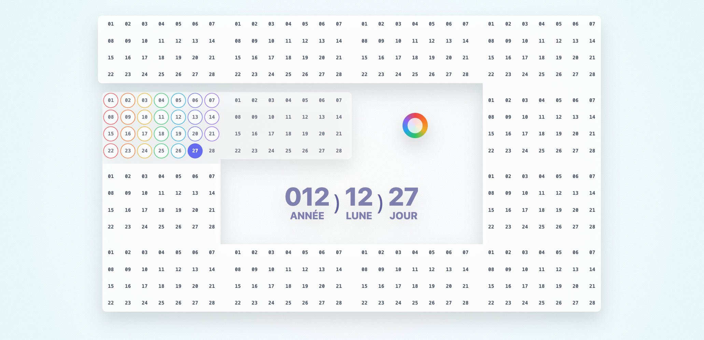

# Welcome to Natural Time

A new/old approach to time measurement


> This is the repository for the web application hosted at [naturaltime.app](https://naturaltime.app)

Natural Time is a system that reinvents how time is measured. Through a 360-degree clock and a 13-moon spiral calendar, the sun serves as the universal reference for the flow of time.

## About

### The Natural Clock
A clock inspired by nature, with a single hand rotating once per day, following the sun's path across the sky along a 360-degree dial.


### The 13 Moons Calendar
An alternative to the Gregorian calendar, drawing from worldwide traditions:
- 13 moons (months) of 28 days each
- One rainbow day
- 13 moons × 28 days + 1 = 365



Together, the Natural Clock and the 13 Moons Spiral can replace or complement the 24-hour clock and Gregorian calendar.

Read more about Natural Time on [naturaltime.app](https://naturaltime.app)

## Project Components

The Natural Time project consists of three main repositories:

1. **Natural Time Specifications** ([github.com/sylvain441/natural-time](https://github.com/sylvain441/natural-time))  
   Complete specifications of the Natural Time system (in English)

2. **Natural Time JS Library** ([github.com/sylvain441/natural-time-js](https://github.com/sylvain441/natural-time-js))  
   JavaScript library for Natural Time calculations

3. **Natural Time App** ([github.com/sylvain441/natural-time-app](https://github.com/sylvain441/natural-time-app))  
   Vue.js application for the Natural Time clock ([naturaltime.app](https://naturaltime.app))

## Project Setup

```sh
npm install
```

### Compile and Hot-Reload for Development

```sh
npm run dev
```

### Compile and Minify for Production

```sh
npm run build
```

### Test the compiled production version

```sh
npm run preview
```

## Contribute

Let's talk about it 
- Email: [sylvain441@proton.me](mailto:sylvain441@proton.me)
- Telegram: [@sylvain441](https://t.me/sylvain441)

